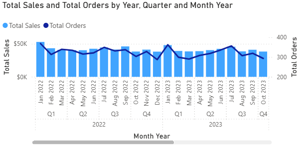
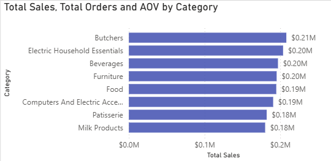
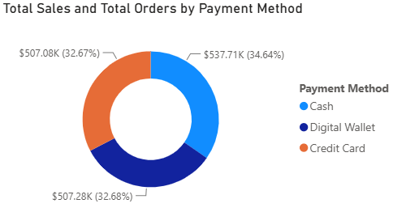
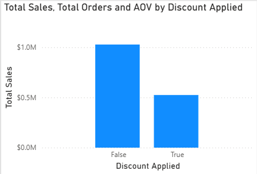

# 📊 Retail Sales Performance & Profitability Analysis


## 📌 Executive Summary
This project delivers an interactive 1-page **Power BI Executive Dashboard** analyzing transactional sales, profitability, and customer purchasing trends for a global retail dataset. By transforming raw, unformatted transaction logs into structured metrics, this solution enables business stakeholders to evaluate revenue growth, discount strategy impacts, and regional performance.

---

## 🛠️ Tech Stack & Skills
* **Business Intelligence:** Power BI Desktop
* **Data Engineering & ETL:** Power Query (M Code)
* **Data Modeling & Analytics:** DAX (Data Analysis Expressions), Time Intelligence
* **Data Storage & Pipeline:** CSV, Excel, Git, GitHub
* **Core Analytics Domain:** E-Commerce / Retail KPIs (AOV, YoY Sales Growth %, Discount Erosion)

---

## 📁 Repository Structure
```text
ecommerce-sales-analysis/
│
├── data/
│   ├── raw/                  <-- Original dirty transactional dataset
│   └── processed/            <-- Cleaned, schema-validated export
│
├── power_bi/
│   └── Sales_Performance_Dashboard.pbix   <-- Main Power BI file
│
├── docs/
│   ├── screenshots/          <-- High-resolution dashboard previews
│   └── dax_measures.md       <-- Complete DAX code documentation
│
├── .gitignore                <-- Git untracked lock/temp files
└── README.md                 <-- Executive project documentation
```

## 🔍 Data Quality Audit & Cleaning (Power Query)
During initial exploratory analysis of the raw transactional dataset (`dirty_retail_sales.csv`), several systemic database logging anomalies and corrupted fields were identified and resolved:

### Key ETL Transformations Executed:
* **POS Logging Anomaly & Corrupt Record Removal:** Identified that header metadata (`Transaction ID` and `Date`) remained intact across all rows, but product line-item metadata (`Item ID`) consistently failed to log whenever `Quantity` or `Total Spent` dropped out. Filtered out unrecoverable records missing revenue, unit count, and pricing simultaneously to prevent metric skew.
* **Revenue & Metric Imputation:** Recalculated missing revenue for valid sales using custom M-code logic (`Total Spent = Quantity * Price Per Unit`). Standardized missing product catalog IDs on valid transactions as `"NA"` / `"Unspecified Item"` to preserve total revenue reconciliation.
* **Boolean Field Normalization:** Resolved 30% missing (`null`) entries in `Discount Applied` by converting them to `FALSE`, establishing a clean binary filter for promotional vs. full-price transactions.
* **Text Standardisation & Formatting:** Trimmed trailing whitespace, capitalized text strings across `Gender`, `Category`, and `Payment Method`, and enforced strict ISO date data types across all order logs.

---

## 📐 Data Modeling & Architecture
A star-schema data model was built using a dedicated calendar dimension (`Dim_Date`) to support advanced time-intelligence functions and dynamic date filtering.

```text
+-------------------+           +----------------------------+
|     Dim_Date      | 1       * |    dirty_retail_sales      |
+-------------------+-----------+----------------------------+
| Date (PK)         |           | Transaction ID             |
| Year              |           | Date (FK)                  |
| Month Name        |           | Customer ID                |
| Quarter           |           | Total Spent                |
| Day of Week       |           | Quantity                   |
+-------------------+           +----------------------------+
```

### 🧮 Explicit DAX Measures Created:
* **Core Metrics:** `Total Sales`, `Total Orders`, `Total Quantity Sold`, `AOV`
* **Time Intelligence:** `Sales PY`, `YoY Sales Growth %`
* 📄 *For the complete DAX code formulas and documentation, see [`docs/dax_measures.md`](docs/dax_measures.md).*
---

## 📈 Executive Visual & Insight Breakdown

### 1. Revenue & Order Volume Trend over Time



* **Visual Type:** Line & Clustered Column Combo Chart *(configured with `Year` → `Quarter` → `Month` Drill-Down Hierarchy)*
* **Key Finding:** Total sales reached **$1.55M** across **11,971 orders**. Monthly revenue maintains a steady baseline around $40K–$50K. Notably, **January exhibits a recurring annual sales peak** ($52.9K in Jan 2022, $48.1K in Jan 2023, $47.9K in Jan 2024).
* **Business Takeaway:** January surges reflect post-holiday gift card redemptions, new-year essential restocking, and clearance promotions. Supply chain and procurement teams must optimize inventory replenishment in late December to prevent stockouts during the January demand wave.

---

### 2. Category Performance Breakdown



* **Visual Type:** Clustered Horizontal Bar Chart
* **Key Finding:** **Butchers** ($208.12K | 13.41%) and **Electric Household Essentials** ($203.81K | 13.13%) generate the highest net revenue, carrying the highest Average Order Values (~$138/checkout). **Patisserie** ranks lowest ($182.17K | 11.74%).
* **Business Takeaway:** High-ticket categories drive top-line revenue margin. Cross-selling or bundling lower-performing categories (e.g., bundling Patisserie items with Beverages) can effectively lift overall basket sizes.

---

### 3. Payment Method Preferences



* **Visual Type:** Donut Chart (`Payment Method` vs. `Total Sales`)
* **Key Finding:** Revenue is evenly distributed across payment options, led slightly by **Cash** ($537.71K | 34.6%), followed by **Digital Wallet** ($507.28K | 32.7%) and **Credit Card** ($507.08K | 32.7%).
* **Business Takeaway:** Digital payment options (Digital Wallet + Credit Card) represent over 65% of total sales volume. Maintaining seamless mobile and digital checkout integrations is critical to minimizing cart abandonment.

---

### 4. Promotional & Discount Impact



* **Visual Type:** Clustered Column Chart (`Discount Applied = True vs. False`)
* **Key Finding:** Full-price transactions (`False`) generate **$1.02M** (~66%) of total revenue, while discounted transactions (`True`) account for **$532K** (~34%). 
* **Business Takeaway:** The store maintains strong full-price pricing power. Discounts effectively boost order volume without heavily eroding net profitability.

---

## 💡 Key Business Insights (Executive Summary)

* **Consistent Top-Line Health:** Overall YoY revenue growth sits at **+1.67%**, maintaining steady financial performance across operating years.
* **Pricing Power & Margin Defense:** A 2:1 full-price to discount revenue ratio ($1.02M vs $532K) indicates strong customer willingness to pay without relying on constant promotional discounting.
* **January Seasonality Strategy:** January serves as the primary annual revenue driver across all years, requiring preemptive Q4 logistics planning.
* **Digital Checkout Dominance:** Over 65% of transactions are processed digitally (Credit Card + Digital Wallet), making digital gateway uptime essential for sales continuity.

---

## 🚀 How to Run & View This Project
1. **Download the Repository:** Clone or download this repo to your local machine:
   ```bash
   git clone [https://github.com/Kaust22/Retail_Sales_Analysis.git](https://github.com/Kaust22/Retail_Sales_Analysis.git)
   ```
2. **Open the Dashboard:** Open power_bi/Sales_Performance_Dashboard.pbix using Power BI Desktop.

3. **Inspect the Data Pipeline:** View Power Query steps directly via Home -> Transform Data to audit M-code steps.
---