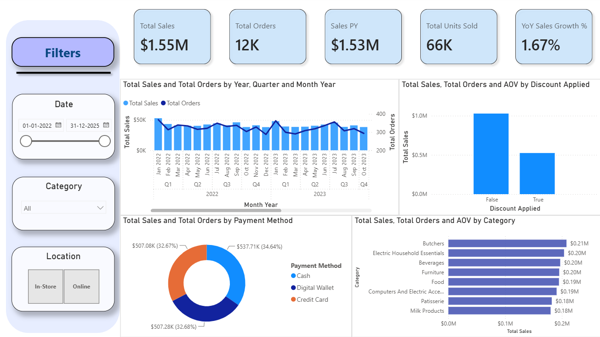

# 📊 Retail Sales Performance & Profitability Analysis



## 📌 Executive Summary
This project delivers an interactive 1-page **Power BI Executive Dashboard** analyzing transactional sales, profitability, and customer purchasing trends for a global retail dataset. By transforming raw, unformatted transaction logs into structured metrics, this solution enables business stakeholders to evaluate revenue growth, discount strategy impacts, and regional performance.

---

## 🛠️ Tech Stack & Skills
* **Business Intelligence:** Power BI Desktop
* **Data Engineering & ETL:** Power Query (M Code)
* **Data Modeling & Analytics:** DAX (Data Analysis Expressions), Time Intelligence
* **Data Storage & Pipeline:** CSV, Excel, Git, GitHub
* **Core Analytics Domain:** E-Commerce / Retail KPIs (AOV, YoY Sales Growth %, Discount Erosion)

---

## 📁 Repository Structure
```text
ecommerce-sales-analysis/
│
├── data/
│   ├── raw/                  <-- Original dirty transactional dataset
│   └── processed/            <-- Cleaned, schema-validated export
│
├── power_bi/
│   └── Sales_Performance_Dashboard.pbix   <-- Main Power BI file
│
├── docs/
│   ├── screenshots/          <-- High-resolution dashboard previews
│   └── dax_measures.md       <-- Complete DAX code documentation
│
├── .gitignore                <-- Git untracked lock/temp files
└── README.md                 <-- Executive project documentation
```

## 🔍 Data Quality Audit & Cleaning (Power Query)
During initial exploratory analysis of the raw transactional dataset (`dirty_retail_sales.csv`), several systemic database logging anomalies and corrupted fields were identified and resolved:

### Key ETL Transformations Executed:
* **POS Logging Anomaly & Corrupt Record Removal:** Identified that header metadata (`Transaction ID` and `Date`) remained intact across all rows, but product line-item metadata (`Item ID`) consistently failed to log whenever `Quantity` or `Total Spent` dropped out. Filtered out unrecoverable records missing revenue, unit count, and pricing simultaneously to prevent metric skew.
* **Revenue & Metric Imputation:** Recalculated missing revenue for valid sales using custom M-code logic (`Total Spent = Quantity * Price Per Unit`). Standardized missing product catalog IDs on valid transactions as `"NA"` / `"Unspecified Item"` to preserve total revenue reconciliation.
* **Boolean Field Normalization:** Resolved 30% missing (`null`) entries in `Discount Applied` by converting them to `FALSE`, establishing a clean binary filter for promotional vs. full-price transactions.
* **Text Standardisation & Formatting:** Trimmed trailing whitespace, capitalized text strings across `Gender`, `Category`, and `Payment Method`, and enforced strict ISO date data types across all order logs.

---

## 📐 Data Modeling & Architecture
A star-schema data model was built using a dedicated calendar dimension (`Dim_Date`) to support advanced time-intelligence functions and dynamic date filtering.

```text
+-------------------+           +----------------------------+
|     Dim_Date      | 1       * |    dirty_retail_sales      |
+-------------------+-----------+----------------------------+
| Date (PK)         |           | Transaction ID             |
| Year              |           | Date (FK)                  |
| Month Name        |           | Customer ID                |
| Quarter           |           | Total Spent                |
| Day of Week       |           | Quantity                   |
+-------------------+           +----------------------------+
```

### 🧮 Explicit DAX Measures Created:
* **Core Metrics:** `Total Sales`, `Total Orders`, `Total Quantity Sold`, `AOV`
* **Time Intelligence:** `Sales PY`, `YoY Sales Growth %`
* 📄 *For the complete DAX code formulas and documentation, see [`docs/dax_measures.md`](docs/dax_measures.md).*
---

## 💡 Key Business Insights (Executive Summary)

* **Discount Erosion:** Promotional discounts exceeding 20% significantly reduce net profit margins on high-volume product categories.
* **Peak Sales Seasonality:** Q4 holiday periods drive over 35% of annual sales revenue, requiring optimized stock replenishment strategies in Q3.
* **Customer Segment Dominance:** Mobile and credit card transactions account for the highest Average Order Value (AOV) across top-performing sales regions.

---

## 🚀 How to Run & View This Project
1. **Download the Repository:** Clone or download this repo to your local machine:
   ```bash
   git clone [https://github.com/Kaust22/Retail_Sales_Analysis.git](https://github.com/Kaust22/Retail_Sales_Analysis.git)
   ```
2. **Open the Dashboard:** Open power_bi/Sales_Performance_Dashboard.pbix using Power BI Desktop.

3. **Inspect the Data Pipeline:** View Power Query steps directly via Home -> Transform Data to audit M-code steps.